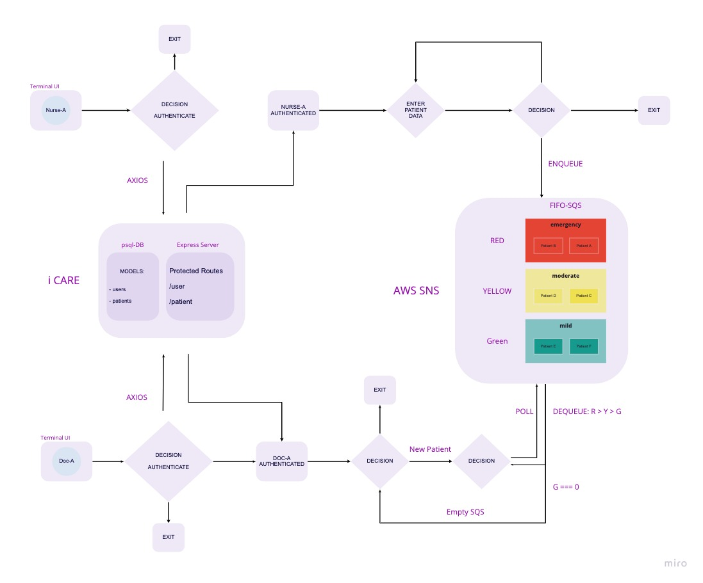

<h1 align="center">Welcome to</h1>


## Description

**iCare** is an app designed to manage the flow of walk-in patients in an urgent care center. A triage nurse can assign walk-in patients into one of the three queues (red, yellow or green), based on severity of their symptoms. Providers will also use the same app to attend to patients by grabbing a next patient from the queue with a highest priority. So, providers wil attend to all of the red queue patients first, before being assigned to patients from lower queues.

The app is scalable and can be used by multiple triage personnel and providers at the same time.

## Usage

1. Create AWS account, and create three SNS FIFO topics (red, yellow, green) and three SQS FIFO queues (red, yellow, green). Subscribe SQS queues to corresponding SNS topics (red to red, etc).
2. Clone down iCare repo, and deploy it to Heroku.
3. Clone the repository TerminalUI to your local machine.
4. Run ``` npm i ``` to install dependencies
5. Create ```.env``` file and copy variable names from ```sample.env```. Then provide your own values for the env variables. (Heroku deployed link, AWS access keys, three SNS topic arns and three SQS http urls, and AWS region)  
6. Run ``` pkg . ``` to compile the executables for Windows, macOS or Linux
7. For Windows, double click on a created file with .exe extension to run the app
8. For macOs/Linus, turn the file into Unix executable by using ```chmod +x /path/file-name``` in the Terminal, then double click the app.

## Run tests

```sh
npm run test
```
## # iCare [](https://github.com/doc-devs/iCare-V2/actions/workflows/js-tests.yml)

Urgent care patient queue system

## Deployments

dev: [Heroku](https://ii-care.herokuapp.com/userPortal)

## Team members

- Lorenzo Ortega
- Ayrat Gimranov
- Mark Thanadabouth

## Domain Modeling



## Routes

[authRoutes](src/auth/authRoute.js)

Where user : Nurse, Doctor

<pre>
GET   /userPortal     home (P.O.L.)
POST  /signup         create a user
POST  /signin         signin with basic auth

</pre>

## Project Description

An app that can be used by front desk RN of an emergency department to accept and assign walk-in patients into queues based on priority of their symptoms.

## User Stories

Feature Tasks:

- " As a Nurse, I want to be able to create a new account, so that I can have Nurse-permission's for queue system"
- " As a Physician, I want to be able to create a new account, so that I can have Physician-permission's for queue system"
- " As a Nurse, I want input arriving patient information, so that I can queue them-up for the Physician "
- " As a Physician, I want to process patients based on priority-level, so that I can create a treat-plan "
- " As a Nurse, I want to be able to move patients to another queue, so that if the patient's condition worsens they can be seen faster"

## Software Requirements

[click Here](./requirements.md)

## Show your support

Give a ⭐️ if this project helped you!

***
_This README was generated with ❤️ by [readme-md-generator](https://github.com/kefranabg/readme-md-generator)_

